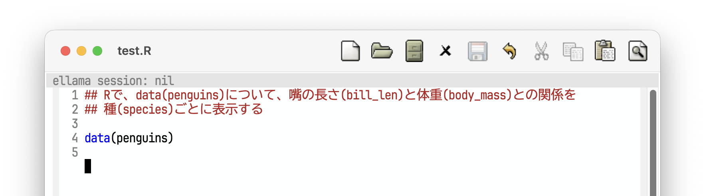
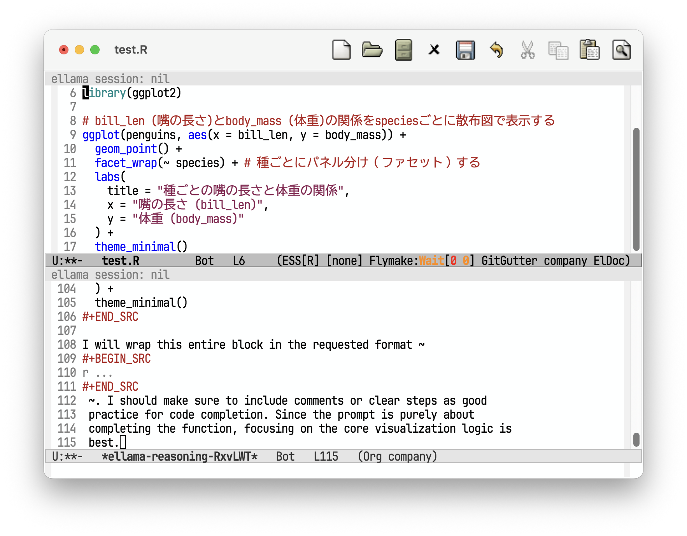

## 自己紹介

- 氏名: 伊東宏樹

- 個人事業主（[伊東生態統計研究室](https://ito4303.sakura.ne.jp/)）

- 出版物: 『[BUGSで学ぶ階層モデリング入門](https://www.kyoritsu-pub.co.jp/book/b10003729.html)』『[生態学のための階層モデリング](https://www.kyoritsu-pub.co.jp/book/b10003301.html)』（以上共訳）など

- [Kanazawa.R](https://kanazawar.connpass.com/)
  - 年2回開催してます。次回は11月ごろ(?)

## はじめに

::: {.incremental}
- RStudioやPositronでPosit AIをつかうと便利だが
  - お金がかかる
  - 外に出せない内容は扱えない

- そういうときは
  - ローカルLLM
:::

## Ollama

- <https://ollama.com/>

- オープンソースのLLMをうごかせる

- Rでは[ollamar](https://cran.r-project.org/package=ollamar)や[ellmer](https://cran.r-project.org/package=ellmer)パッケージで利用可能

## Emacs

- 1970からあるテキストエディタ

- GNU Emacsが有名

## ESS (Emacs Speaks Statics)

- <https://ess.r-project.org/>

- Emacsパッケージ

  - Emacsで、Rなどの統計言語のスクリプトを編集・実行できる

## Ellama

- <https://github.com/s-kostyaev/ellama>

- EmacsからOllamaをつかうEmacsパッケージ

- 設定など

  - [最強ローカルLLM実行環境としてのEmacs](https://blog.tomoya.dev/posts/emacs-on-local-llm/)
  
  - [EmacsでローカルLLMのEllamaを日本語で扱う設定](https://qiita.com/keita44_f4/items/2386e1623b3e3199efc0)

## 実行例

:::{style = "margin-top: 1em;"}
### 実行環境

- MacBook Air (M5) メモリ16GB

- gemma4:e4b
:::

## コード補完

`M-x ellama-code-complete`

---

### 結果

:::{style = "margin-top: -1em;"}

:::

## その他

- コードレビュー

  - `M-x ellama-code-review`

- チャット

  - `M-x ellama-chat`

など

## おわりに

- Posit AIとはちがって、オブジェクトの中身までは見ない

- 制限があるなかでもそれなりにできた

- メモリを大量につんだ計算機で、大きなモデルをつかえば、もっとよい結果が得られるかも

